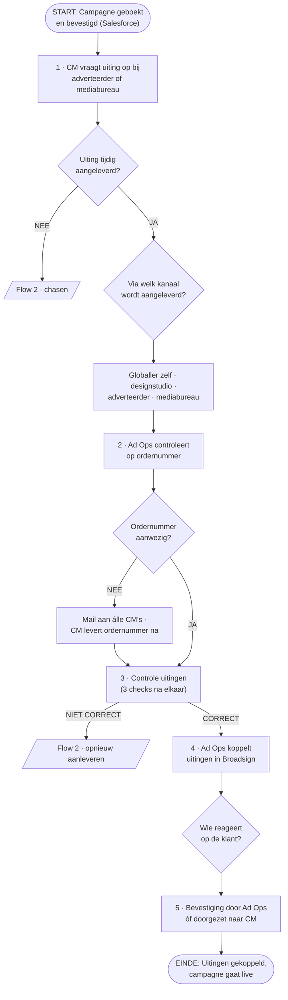

# Creaties verzamelen — zo werkt het vandaag (as-is)

**Status:** werkdocument · gebaseerd op de werksessie met het team (Deel F) en de
gevalideerde procesflows op GitHub
**Scope:** Fase 1 van de AI Challenge · het proces van boeking tot livegang
**Buiten scope:** Flow 2 (het herstel- en naloopproces: chasen en opnieuw aanleveren)

---

## Over dit document

Dit document beschrijft uitgebreid hoe het verzamelen van creaties (uitingen)
bij Global vandaag werkt: wie er in het proces zitten, wat elke gebruiker
feitelijk doet, waar de pijnpunten liggen, wat we over de tijdsdruk weten en
hoe je dit verhaal helder aan anderen uitlegt.

Het is gebaseerd op twee bronnen uit deze repository:

1. **De as-is procesflow** (`archief/creaties-verzamelen-validatie/`) — de
   huidige werkwijze zoals in de werksessie met het team in kaart gebracht en
   daarna ter validatie voorgelegd, inclusief alle feitelijke pijnpunten per
   processtap.
2. **De to-be procesflow v2** (`archief/creaties-verzamelen-validatie/to-be/`)
   — het toekomstige procesontwerp. Dit document gaat níet over de oplossing,
   maar het to-be-ontwerp is wel gebruikt als spiegel: elke to-be-stap benoemt
   expliciet welk as-is-pijnpunt hij vervangt. Dat maakt scherp welke
   problemen in de huidige situatie structureel zijn.

---

## 1. Het proces in het kort

Een klant boekt een campagne voor de schermen en objecten van Global. Die
boeking staat bevestigd in **Salesforce**. Vanaf dat moment moet de creatie
(de daadwerkelijke uiting: video of still) worden opgevraagd, aangeleverd,
gecontroleerd en gekoppeld in **Broadsign**, zodat de campagne op de
startdatum live kan. De uiting moet uiterlijk **5 werkdagen (ongeveer 7
kalenderdagen) vóór de startdatum** binnen zijn.

Het proces bestaat vandaag volledig uit handmatige stappen, e-mail en
persoonlijke oplettendheid. Er is geen systeem dat het proces start, bewaakt
of afrondt: de campagnemanager moet zelf signaleren dat er iets moet
gebeuren, iedereen levert aan via zijn eigen kanaal, en niemand kan op enig
moment zien waar een aanlevering staat.

**Kerngegevens**

| | |
| --- | --- |
| Trigger | Campagne geboekt en bevestigd (orderbevestiging in Salesforce) |
| Einde | Uitingen gekoppeld in Broadsign, campagne gaat live |
| Aanlevernorm | Uiterlijk 5 werkdagen vóór de startdatum van de campagne |
| Systemen | Salesforce (boeking, gekoppeld met Broadsign), e-mail, Broadsign (koppeling) |
| Eindverantwoordelijk | AM/CM, bij elke stap (tenzij anders vermeld) |
| Herstelproces | Flow 2: chasen bij te late aanlevering en opnieuw opvragen bij afkeuring (apart uitgewerkt, buiten deze scope) |

---

## 2. De gebruikers en hun werkwijze

Het proces kent vier interne rollen en vier externe aanleverkanalen. De
eindverantwoordelijkheid ligt bij elke stap bij de AM/CM; de rol die de stap
feitelijk uitvoert verschilt per stap.

### Campagnemanager (CM) — de handmatige motor van het proces

De CM is degene die het proces draaiend houdt, zonder dat een systeem hem
daarbij helpt:

- **Signaleert zelf** dat er een campagne geboekt is waarvoor een uiting
  opgevraagd moet worden. Er is geen trigger vanuit Salesforce; het proces
  start alleen als de CM eraan denkt.
- **Downloadt per campagne de PDF met campagnedetails** uit Salesforce
  (periode, aantal contacten, objecten, type campagne) en zoekt zelf uit
  *wát* er voor dit type campagne aangeleverd moet worden — de specificaties
  verschillen per campagnetype.
- **Stelt zelf een e-mail op** aan de adverteerder of het mediabureau. Er is
  geen standaardtemplate; de kwaliteit en volledigheid van de uitvraag
  verschillen per CM. In de mail staan twee links naar de generieke
  aanleverspecificaties op global.com (de tariefkaart-pagina en de
  aanleverspecs-PDF), waaruit de klant zelf de juiste specificaties moet
  destilleren.
- **Bewaakt zelf de deadline.** Er is geen automatische signalering dat de
  aanleverdeadline nadert; het najagen (chasen) gebeurt handmatig (Flow 2).
- **Verzamelt en organiseert de aanleveringen** die via allerlei kanalen
  binnenkomen (e-mail, WhatsApp, WeTransfer en dergelijke).
- **Zoekt bij een ordernummer-rondvraag van Ad Ops uit** of het om zijn eigen
  klant gaat, en levert zo nodig het ordernummer na.
- **Controleert mee** op inhoudelijke specificaties (zonder vaste checklist)
  en **stemt bij problemen af** met bureau, adverteerder of designer.
- **Stuurt soms de bevestiging** aan de klant dat de uiting goed ontvangen en
  verwerkt is — soms, want er is geen afspraak over wie dat doet.

### Accountmanager (AM) — eindverantwoordelijk, gedeeld uitvoerend

De AM is samen met de CM formeel eindverantwoordelijk voor elke stap. In de
praktijk voert de AM dezelfde soort taken uit als de CM (controle,
afstemming, soms de klantbevestiging) en levert een AM soms zelf uitingen aan
als "Globaller". Het onderscheid tussen wie wat doet is niet vastgelegd —
dat is een van de kernproblemen.

### Ad Operations / Digitale Planning (Ad Ops) — controle en koppeling

Ad Ops komt in beeld zodra een uiting binnen is:

- **Controleert of er een ordernummer bij de aanlevering zit.** Zonder
  ordernummer kan de uiting niet aan de juiste campagne worden gekoppeld.
- **Mailt bij een ontbrekend ordernummer het hele team campagnemanagers
  tegelijk** — Ad Ops heeft onvoldoende achtergrondinformatie om te bepalen
  wiens klant het is, dus de vraag gaat ongericht het team in.
- **Controleert de uitingen** samen met AM/CM in drie opeenvolgende checks
  (techniek, inhoud, varianten — zie fase 4 hieronder).
- **Koppelt de goedgekeurde uitingen in Broadsign.**
- **Mailt soms de goede ontvangst terug** aan de klant — ook hier: soms.

### Globaller (AM, CM of designmanager) — intern aanleverkanaal

Een collega van Global kan de uiting ook zelf aanleveren, bijvoorbeeld als de
designmanager de creatie heeft gemaakt. Dit gebeurt via dezelfde
ongestructureerde kanalen als extern (WhatsApp, mail, WeTransfer).

### Externe partijen — drie aanleverkanalen, nul zicht

| Kanaal | Wie maakt de creatie | Wat Global ervan ziet |
| --- | --- | --- |
| **Adverteerder** | De adverteerder zelf of diens designafdeling | Niets tot de aanlevering binnenkomt. Bij weinig ervaring met creaties is de aanlevering vaak niet conform specificaties. |
| **Mediabureau** | Niet het bureau zelf: een reclamebureau of designstudio, soms inhouse, soms een externe partner | Niets. Het bureau moet zelf een intern proces organiseren met de makende partij; Global is afhankelijk van hoe goed zij dat onderling regelen. |
| **Designstudio / reclamebureau** | De studio zelf, levert rechtstreeks aan | Geen zicht op de voortgang en geen rechtstreeks contact — terugkoppelen bij fouten is daardoor ingewikkeld. |

---

## 3. De flow stap voor stap

Het proces bestaat uit zes fasen. Onderstaand diagram toont de hoofdlijn; de
NEE- en NIET CORRECT-takken lopen naar Flow 2 (buiten scope).

### Fase 1 · Start en uitvraag

**Trigger:** de klant boekt een campagne; de orderbevestiging staat in
Salesforce. Vanaf hier ligt er een informatiepakket met wat er opgevraagd
moet worden — maar niets of niemand geeft daar een seintje over.

**Wat er gebeurt:** de CM start handmatig het opvraagtraject richting de
adverteerder of het mediabureau:

1. PDF met campagnedetails downloaden uit Salesforce (periode, aantal
   contacten, objecten, type campagne).
2. E-mail opstellen met aanleverinstructie. Geen standaardtemplate. De
   aanleverspecificaties worden gedeeld via twee klikbare links: de pagina
   "Tariefkaart en aanleverspecificaties" op global.com en de PDF
   "Aanleverspecs 2026".
3. De klant zoekt zelf in die documenten de juiste specificaties op en zet
   deze uit bij de eigen designafdeling of het bureau.

**Pijnpunten (uit de werksessie):**

- Geen trigger vanuit Salesforce dat het tijd is om op te vragen. De CM moet
  zelf signaleren dát er opgevraagd moet worden en het proces zelfstandig
  initiëren.
- Geen overzicht van openstaande uitvragen. Opvragen is een terugkerende
  handmatige actie.
- De CM moet per campagne zelf uitzoeken wát er opgevraagd moet worden; de
  specificaties verschillen per type campagne.
- Geen standaard e-mailtemplate. Kwaliteit en volledigheid van de uitvraag
  verschillen per CM. Een mediabureau leest de volledige bevestigingsmail
  bovendien niet altijd.
- De aanleverspecificaties achter de links zijn uitgebreid en complex; de
  klant moet zelf uitzoeken wat van toepassing is. Goede CM's halen de
  juiste specificaties eruit en zetten die in de mail — maar dat gebeurt
  niet altijd.

### Fase 2 · Tijdigheid en aanlevering

**Beslissing: uiting tijdig aangeleverd?** Norm is uiterlijk 5 werkdagen
(ongeveer 7 kalenderdagen) vóór de startdatum. Is de uiting er niet op tijd,
dan start het handmatige chasen (Flow 2). Pijnpunt: er is geen automatische
signalering dat de deadline nadert.

**Aanlevering via een van vier kanalen** (routering bepaalt de externe
partij, niet Global):

- **Globallers zelf** — pijnpunten: de aanlevering komt via verschillende
  stakeholders bij de AM/CM binnen, loopt via verschillende kanalen
  (WhatsApp, e-mail, WeTransfer en dergelijke) en de AM/CM moet alles zelf
  verzamelen en organiseren.
- **Designstudio** — pijnpunten: Global heeft geen zicht op de voortgang van
  dit externe proces en geen rechtstreeks contact met de studio;
  terugkoppelen bij fouten of onduidelijkheden is daardoor ingewikkeld.
- **Adverteerder** — pijnpunten: de adverteerder moet zelf actie ondernemen
  en levert bij weinig ervaring vaak niet conform specificaties aan. Dat is
  inefficiënt en geeft herstelwerk en risico.
- **Mediabureau (inhouse plus third-party designers)** — pijnpunten: het
  bureau maakt de creatie zelf niet en moet een intern proces organiseren met
  de makende partij; Global is afhankelijk van hoe goed zij dat onderling
  regelen.

### Fase 3 · Ordernummer

**Wat er gebeurt:** zodra de uiting binnen is, controleert Ad Ops (Digitale
Planning) of er een ordernummer bij de aanlevering zit, zodat de uiting aan
de juiste campagne gekoppeld kan worden. Ontbreekt het ordernummer, dan mailt
Ad Ops het team campagnemanagers; de CM haalt het ordernummer op bij de klant
of zoekt het zelf op en levert het aan.

**Pijnpunten (uit de werksessie):**

- Bij een ontbrekend ordernummer stuurt Ad Ops een informatieverzoek naar
  **álle campagnemanagers tegelijk**, niet gericht aan de juiste persoon.
- Ad Ops heeft onvoldoende achtergrondinformatie om te bepalen wiens klant
  het is; de handoff komt zonder duidelijke context.
- Elke CM moet eerst zelf uitzoeken of het om de eigen klant gaat —
  inefficiënt uitzoekwerk voor het hele team.
- Zodra de handoff gedaan is, is er **geen proceseigenaar of bewaker meer**.
  Niemand ziet of en wanneer het wordt opgepakt.
- Soms zijn er meerdere ordernummers per campagne; dan moet intern handmatig
  achterhaald worden welke ordernummers bij de campagne horen.

### Fase 4 · Controle

De aangeleverde uitingen worden door Ad Ops en AM/CM in **drie opeenvolgende
checks** gecontroleerd. Keurt een check af, dan gaat het terug naar de klant
en start het aanleverproces opnieuw (Flow 2).

1. **Check 1 · Technische specificaties** — aan de hand van het
   specificatiedocument: afmetingen, duur en lengte, motion of stilstaand,
   kleurgebruik, geen geluid.
2. **Check 2 · Inhoudelijke specificaties** — voldoet de uiting aan de
   afspraken met de partners op wier locaties de uiting komt (gemeentes,
   retailers)? Voorbeeld: in bepaalde gemeentes is reclame voor vlees in de
   buitenruimte niet toegestaan. Daarnaast een representativiteitscheck:
   klopt de uiting inhoudelijk en is deze foutloos, zodat er niets op straat
   komt dat niet representatief is. Global bewaakt hiermee mede de belangen
   van de partners. **Pijnpunt:** er is geen vaste checklist voor deze
   controle; de AM/CM moet zelf bedenken waarop gecontroleerd moet worden.
3. **Check 3 · Overige check** — zijn er meerdere uitingen binnen dezelfde
   campagne en kloppen de varianten: één uiting voor alle netwerken of per
   netwerk anders, per stad anders, per point of interest anders, enzovoort.

Let op: deze checks gebeuren **na elkaar** en pas nadat de uiting is
aangeleverd — een technische fout die bij aanlevering al zichtbaar had kunnen
zijn, wordt hier pas dagen later ontdekt, terwijl de 5-werkdagenklok
doorloopt.

### Fase 5 · Koppeling

Ad Ops koppelt de gecontroleerde uitingen aan de campagne in **Broadsign**.
(Toekomst, buiten deze as-is: over 12 tot 18 maanden verloopt de koppeling
via de gCam-oplossing; vandaag is Broadsign leidend.)

### Fase 6 · Bevestiging en einde

Na de koppeling zou de klant een bevestiging moeten krijgen dat de uiting in
goede orde is ontvangen en verwerkt. **Er is geen standaardproces voor wie
dit doet** — de beslissing "wie reageert op de klant?" is zelf het pijnpunt:

- Geen standaardproces voor de terugkoppeling; onduidelijk wie ervoor
  verantwoordelijk is.
- De bevestiging wordt **soms helemaal niet verstuurd**.
- Soms doet Ad Ops het, soms de campagnemanager, soms de accountmanager — en
  zij zijn niet van elkaar op de hoogte wie wat al heeft gestuurd.
- Iedereen hanteert een eigen systematiek en eigen formulering. Er is geen
  vastlegging of monitoring dat de bevestiging daadwerkelijk is verstuurd;
  de mailbox moet handmatig in de gaten gehouden worden om te weten dat er
  een bevestiging is verstuurd en door wie.
- Aandachtspunt uit de werksessie: de bevestiging gaat naar het creatieve
  bureau en niet naar het mediabureau. Er is onduidelijkheid over wie
  verantwoordelijk is voor de communicatie naar bureau of adverteerder dat de
  uiting gekoppeld is.

Daarna is het proces afgerond: de uitingen zijn gekoppeld en de campagne
gaat live.

### Flow 2 · het herstelproces (buiten scope, wel relevant)

Flow 2 is het aparte naloopproces met twee sporen: **chasen** (instroom
vanaf "uiting tijdig aangeleverd?" bij NEE) en **incorrecte aanlevering,
proces start opnieuw** (instroom vanaf de drie checks bij NIET CORRECT). Het
bestaat, kost het team merkbaar tijd, maar is bewust buiten deze
visualisatie gehouden en wordt apart uitgewerkt. Voor het begrip van de
huidige situatie is vooral belangrijk: **elke keer dat een van de pijnpunten
hierboven toeslaat, belandt het werk in dit handmatige herstelproces.**

---

## 4. De pijnpunten gebundeld

### Vier overkoepelende observaties uit de werksessie

1. **Overzicht van het proces ontbreekt.** Niemand kan zien welke uitvragen
   openstaan, waar een aanlevering staat of wat er vandaag moet gebeuren.
2. **Duidelijk eigenaarschap en heldere verantwoordelijkheden ontbreken.**
   Formeel is AM/CM overal verantwoordelijk, maar per stap is niet belegd wie
   feitelijk aan zet is — met de klantbevestiging als duidelijkste voorbeeld.
3. **Communicatie, intern en extern, is niet gestructureerd.** Uitvragen
   zonder template, aanleveringen via WhatsApp/mail/WeTransfer, ongerichte
   teammails, bevestigingen in ieders eigen bewoordingen.
4. **De kwaliteit van het volledige proces is ongestructureerd.** De uitkomst
   hangt af van de oplettendheid en ervaring van individuele collega's.

### Vijf structurele problemen (de rode draad door alle fasen)

Deze vijf komen rechtstreeks uit de vergelijking met het to-be-ontwerp — het
zijn precies de dingen die het nieuwe proces laat verdwijnen, en dus de
scherpste samenvatting van wat er vandaag mis is:

1. **De ordernummercheck achteraf** — inclusief de ongerichte mail naar alle
   CM's en het handmatige naleveren. Het ordernummer wordt pas gecheckt
   nádat de uiting binnen is, in plaats van afgedwongen bij de aanlevering.
2. **De open vraag "wie reageert op de klant?"** — de bevestiging is geen
   toegewezen, verplichte stap met vastlegging, maar een losse actie die
   soms dubbel en soms helemaal niet gebeurt.
3. **Flow 2 als apart naloopproces** — chasen en herstelwerk zijn handmatige
   routines in plaats van automatische herinneringen en versiebeheer.
4. **Vier ongestructureerde aanleverkanalen** — er is geen enkele intake; wat
   binnenkomt, waar en van wie, wordt nergens geregistreerd.
5. **Zoeken in generieke aanleverspecificaties** — de klant krijgt een link
   naar alles, in plaats van alleen de specificaties die voor zijn campagne
   gelden. Foute aanleveringen zijn daarmee ingebakken.

---

## 5. Hoeveel tijd kost het?

### Wat we zeker weten: de klok is krap en loopt altijd

- De enige harde tijdsnorm in het proces is de **aanleverdeadline: uiterlijk
  5 werkdagen (± 7 kalenderdagen) vóór de startdatum** van de campagne.
  Binnen die 5 werkdagen moet álles gebeuren wat na de aanlevering komt:
  ordernummercheck, drie controles ná elkaar, koppeling en bevestiging.
- De drie controles zijn **sequentieel**: check 2 start pas na check 1,
  check 3 pas na check 2. Elke afkeuring betekent terug naar de klant en
  opnieuw beginnen — binnen dezelfde krimpende klok.
- Er is **geen doorlooptijdmeting**: geen statusmodel, geen logging, geen
  monitoring. Hoe lang een dossier in welke fase staat, weet vandaag niemand.

### Waar de tijd weglekt

De tijd zit in de huidige situatie minder in de handelingen zelf en vooral in
**wachttijd, zoekwerk en herstelwerk**:

| Tijdvreter | Waardoor |
| --- | --- |
| Late start van de uitvraag | Geen trigger uit Salesforce; het proces begint pas als de CM eraan denkt. Elke dag vertraging hier gaat direct van de aanlevertermijn af. |
| Uitzoekwerk per uitvraag | Per campagne zelf uitzoeken welke specificaties gelden, zelf een mail opstellen zonder template. |
| Wachten zonder zicht | Geen beeld van de voortgang bij studio, bureau of adverteerder; chasen gebeurt pas als iemand zelf merkt dat het te lang duurt. |
| De ordernummer-rondvraag | Eén ontbrekend ordernummer zet het hele CM-team aan het uitzoeken wiens klant het is — en daarna bewaakt niemand of het wordt opgepakt. |
| Herstelrondes | Foute aanleveringen (ingebakken door de generieke specificaties) doorlopen het hele traject opnieuw via Flow 2. |
| Sequentiële controle | Drie checks na elkaar in plaats van parallel; een fout wordt pas dagen na aanlevering ontdekt. |
| De bevestiging | Handmatig de mailbox in de gaten houden om te weten óf er al bevestigd is en door wie; soms dubbel werk, soms blijft het liggen. |

### Wat we (nog) niet weten — en zouden moeten meten

In de werksessie zijn geen tijdsbestedingen per stap gemeten; noem in
presentaties dus geen exacte uren zonder meting. Wil je het tijdsargument
hard maken, meet dan (een steekproef volstaat):

| Meting | Waarom dit overtuigt |
| --- | --- |
| Dagen tussen orderbevestiging en verstuurde uitvraag | Maakt de "late start" zichtbaar (geen trigger). |
| Minuten CM-werk per uitvraag (PDF, uitzoeken, mail) | Maakt het terugkerende handwerk per campagne concreet. |
| Percentage aanleveringen zonder ordernummer + teamtijd per rondvraag | Maakt de ongerichte teammail kwantificeerbaar. |
| Percentage eerste aanleveringen dat wordt afgekeurd | Maakt het herstelwerk (Flow 2) zichtbaar. |
| Percentage campagnes dat de 5-werkdagennorm haalt | Dé kop-indicator voor het hele proces. |
| Percentage verstuurde klantbevestigingen | Maakt het gat aan het einde van het proces zichtbaar. |

Het to-be-ontwerp voorziet hierin structureel (statusmodel met 12 statussen,
event log, doorlooptijd per substap) — juist omdat dit inzicht vandaag
volledig ontbreekt.

---

## 6. Zo leg je het helder uit

Het verhaal van de huidige situatie is in drie zinnen te vertellen:

> **Het proces bestaat, maar niets draagt het.** Elke stap gebeurt, maar
> alleen doordat iemand er zelf aan denkt: de start, het chasen, de controle,
> de bevestiging. **Alles wat binnenkomt is ongestructureerd** — vier
> kanalen, geen template, geen registratie — en **niemand kan zien waar iets
> staat**, dus fouten worden laat ontdekt en herstelwerk vreet de krappe
> 5-werkdagentermijn op.

Aanpak die in presentaties goed werkt:

1. **Volg één campagne** in plaats van het diagram uit te leggen. "Een klant
   boekt een campagne. Wie merkt dat? Niemand — totdat de CM het zelf ziet."
   Loop zo de zes fasen langs en stel bij elke stap dezelfde twee vragen:
   *wie doet dit?* en *hoe weet die persoon dat hij aan zet is?* Het antwoord
   op de tweede vraag is bijna overal "dat weet hij niet" — dat is het
   verhaal.
2. **Gebruik de drie herkenbaarste momenten** als illustratie, één per
   procesdeel: de mail-met-twee-links aan het begin (de klant zoekt het zelf
   maar uit), de ordernummer-rondvraag aan het hele team in het midden, en de
   vraag "heeft iemand de klant eigenlijk al bevestigd?" aan het einde.
3. **Scheid feiten van meningen.** Alle pijnpunten in dit document komen uit
   de werksessie en zijn per stap gevalideerd door het team via de
   validatiepagina (stemmen klopt/klopt niet plus reacties). Dat is geen
   opinie van één persoon, maar het gedeelde beeld van de mensen die het werk
   doen.
4. **Sluit af met de vier observaties** (overzicht, eigenaarschap,
   communicatie, kwaliteit) als samenvatting — en pas dáárna, als de vraag
   "en hoe dan wel?" vanzelf komt, het to-be-verhaal.

En zo niet:

- Leg het diagram niet symbool voor symbool uit; het BPMN-jargon
  (gateways, events) leidt af van het verhaal.
- Presenteer geen tijden of percentages die niet gemeten zijn (zie
  hoofdstuk 5) — het kwalitatieve verhaal is sterk genoeg en blijft
  overeind bij doorvragen.
- Maak het niet persoonlijk: het punt is juist dat góede CM's het redden
  door persoonlijke oplettendheid, en dat het proces daarop leunt in plaats
  van dat te ondersteunen.

---

## Bijlage A · Wie voert wat uit (per processtap)

| Stap | Uitvoerder | Eindverantwoordelijk |
| --- | --- | --- |
| Start: campagne geboekt en bevestigd | Extern (klant) | AM/CM |
| 1 · Uiting opvragen bij stakeholders | CM | AM/CM |
| Uiting tijdig aangeleverd? | CM | AM/CM |
| Aanlevering (vier kanalen) | Globaller / designstudio / adverteerder / mediabureau | AM/CM |
| 2 · Controle op ordernummer | Ad Ops | AM/CM |
| Mail om ordernummer + naleveren | Ad Ops → CM | AM/CM |
| 3 · Controle uitingen (3 checks) | Ad Ops en AM/CM | AM/CM |
| 4 · Koppelen in Broadsign | Ad Ops | AM/CM |
| Wie reageert op de klant? | Wisselend: Ad Ops, CM of AM | Onduidelijk — formeel AM/CM; dit is precies het pijnpunt |
| 5 · Bevestiging goede ontvangst | Ad Ops óf CM | AM/CM |

## Bijlage B · Van as-is-pijnpunt naar to-be-antwoord

Voor wie na dit verhaal de brug naar het toekomstige ontwerp wil slaan: het
to-be-proces (v2) benoemt per stap expliciet welk as-is-pijnpunt hij
vervangt. De hoofdlijn:

| As-is-pijnpunt | To-be-antwoord |
| --- | --- |
| Geen trigger, handmatige start | Orderbevestiging in Salesforce start het proces automatisch; dossier met afgeleide deadline |
| Ordernummercheck achteraf, ongerichte teammail | Automatische ordernummerkoppeling; alleen bij uitzondering een gerichte taak bij de juiste CM (G0) |
| Zelf specificaties uitzoeken, generieke links | De tool bepaalt per campagne de benodigde specificaties (specificatieprofielen) |
| Geen template, persoonsafhankelijke uitvraag | Uitvraag gegenereerd uit standaardtemplate; CM reviewt en verstuurt (G1) |
| Vier ongestructureerde kanalen | Eén intake via unieke aanleverlinks, met interne terugvalroute die gelogd wordt |
| Geen zicht, handmatig chasen (Flow 2) | Monitoringoverzicht, automatische herinneringen en escalatieladder |
| Drie sequentiële checks, laat ontdekte fouten | Automatische technische controle direct bij aanlevering; daarna parallelle controle |
| Geen checklist voor de inhoudelijke controle | Vaste taboechecklist per locatieprofiel + representativiteitstoets (AI-engine met menselijke gates) |
| Onduidelijke, soms ontbrekende klantbevestiging | Bevestiging automatisch klaargezet; CM valideert, verstuurt en het wordt gelogd (G4) — pas dan is het dossier afgerond |

**Bronnen in deze repository**

- As-is-flow (validatiepagina): `archief/creaties-verzamelen-validatie/index.html`
- To-be-flow v2 (validatiepagina): `archief/creaties-verzamelen-validatie/to-be/index.html`
- Werkend to-be-prototype van de tool: `prototypes/creaties-verzamelen/index.html`
